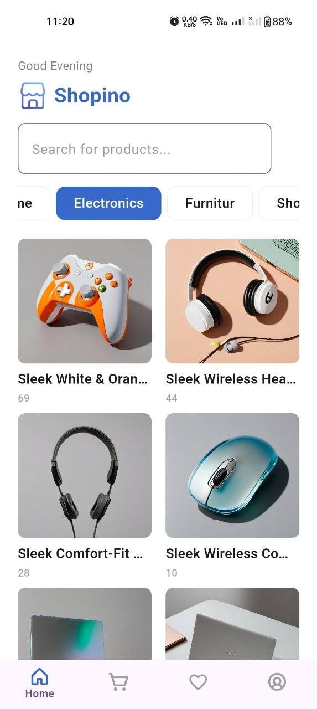
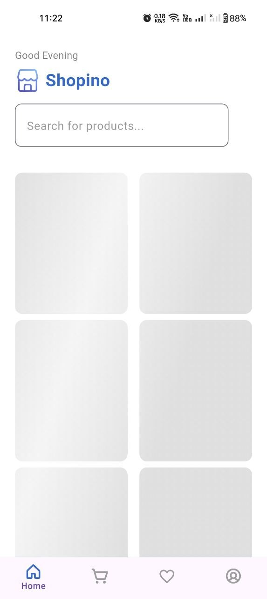
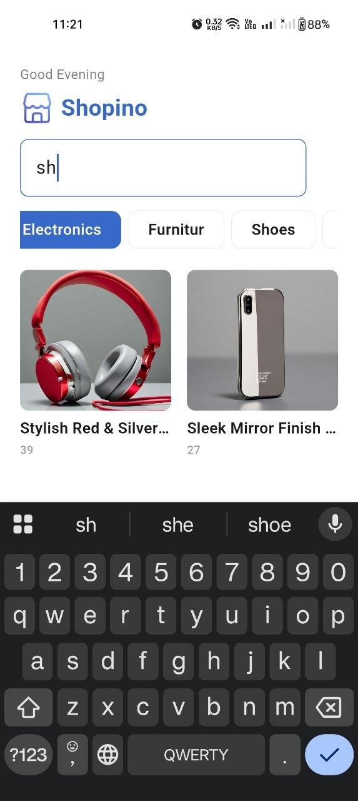
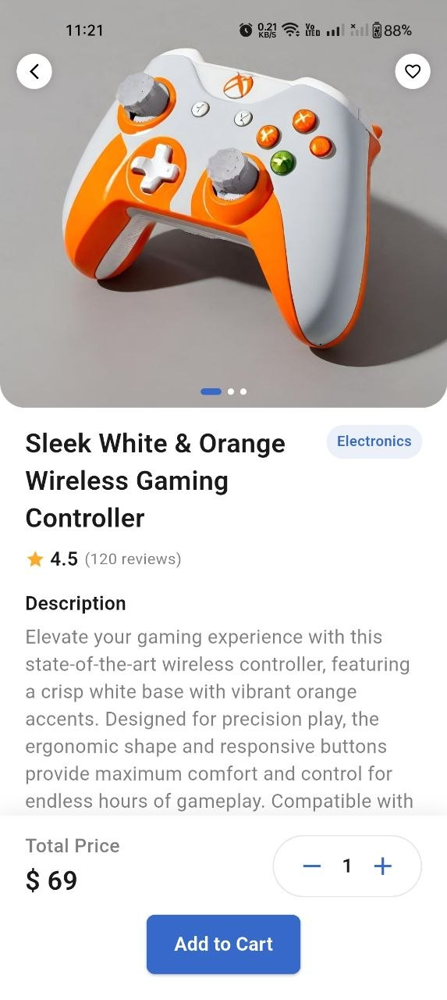
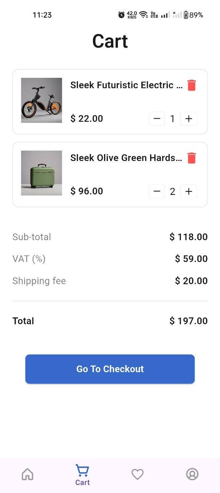
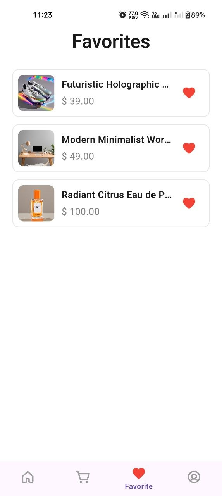
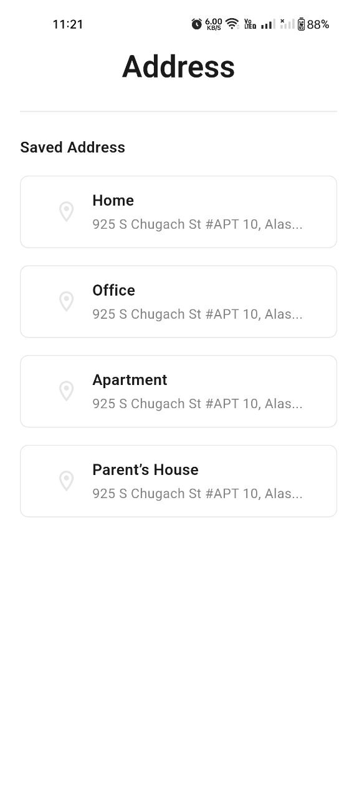
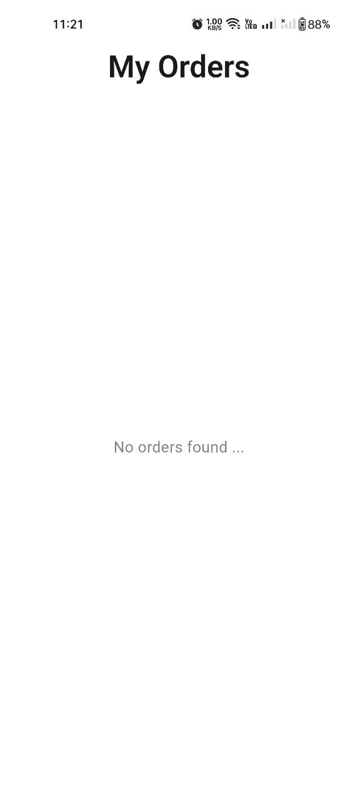

# 🛍️ Shopino

A modern **Flutter e-commerce** application built with **Clean Architecture** and **BLoC/Cubit** state management.

Shopino demonstrates scalable project architecture, maintainable code, a responsive UI, real REST API integration, local persistence, and modern Flutter development best practices.

<p align="center">
  
  
  
  
</p>

---

## 📑 Table of Contents

- [Preview](#-preview)
- [Demo](#-demo)
- [Features](#-features)
- [Upcoming Features](#-upcoming-features)
- [Architecture](#-architecture)
- [Tech Stack](#-tech-stack)
- [Getting Started](#-getting-started)
- [API](#-api)
- [Roadmap](#-roadmap)
- [Author](#-author)

---

## 📱 Preview

<table align="center">
  <tr>
    <td></td>
    <td></td>
    <td></td>
  </tr>
  <tr>
    <td align="center"><sub>Splash Screen</sub></td>
    <td align="center"><sub>Login</sub></td>
    <td align="center"><sub>Sign Up</sub></td>
  </tr>
  <tr>
    <td></td>
    <td></td>
    <td></td>
  </tr>
  <tr>
    <td align="center"><sub>Categories</sub></td>
    <td align="center"><sub>Home (Shimmer Loading)</sub></td>
    <td align="center"><sub>Search</sub></td>
  </tr>
  <tr>
    <td></td>
    <td></td>
    <td></td>
  </tr>
  <tr>
    <td align="center"><sub>Product Details</sub></td>
    <td align="center"><sub>Cart</sub></td>
    <td align="center"><sub>Favorites</sub></td>
  </tr>
  <tr>
    <td></td>
    <td></td>
    <td></td>
  </tr>
  <tr>
    <td align="center"><sub>Account</sub></td>
    <td align="center"><sub>Addresses</sub></td>
    <td align="center"><sub>Orders</sub></td>
  </tr>
  <tr>
    <td></td>
    <td></td>
    <td></td>
  </tr>
  <tr>
    <td align="center"><sub>Log Out</sub></td>
    <td></td>
    <td></td>
  </tr>
</table>

---

## 🎥 Demo

[(https://drive.google.com/file/d/1hLKaIuwPIpzSWSK5bf1QOYVSc8mJMEfF/view?usp=sharing)]

## 📱 APK

[(https://github.com/rimonnnn/shopino_store/releases/tag/v1.0.0)]

---

## ✨ Features

### 🔐 Authentication

- Login
- Sign Up
- Secure token storage

### 🛍 Shopping

- Browse products
- Browse categories
- Product details
- Image gallery
- Hero animations

### 🛒 Cart

- Add products
- Remove products
- Update quantity
- Local persistence

### ❤️ Favorites

- Add & remove favorites
- Global state synchronization

### 👤 Account

- Profile screen
- Delivery addresses
- Order history

### 🎨 UI & UX

- Responsive design
- Cached network images
- Shimmer loading
- Staggered grid animations
- Lottie animations

---

## 🚀 Upcoming Features

- 💳 Payment integration
- 🔍 Product search
- ⭐ Product reviews
- 🧪 Unit testing
- 🧩 Widget testing

---

## 🏗 Architecture

The project follows **feature-first Clean Architecture**:

```
lib
│
├── core
│   ├── networking
│   ├── routing
│   ├── styling
│   ├── utils
│   └── widgets
│
├── features
│   ├── auth
│   ├── home
│   ├── product_details
│   ├── cart
│   ├── favorites
│   ├── address
│   ├── orders
│   ├── account
│   ├── main
│   └── splash
│
└── main.dart
```

Each feature is self-contained and includes its own:

- Cubit
- Models
- Repository
- Screens
- Widgets

---

## 🛠 Tech Stack

| Category             | Packages                             |
| -------------------- | ------------------------------------ |
| State Management     | flutter_bloc (Cubit)                 |
| Networking           | dio, pretty_dio_logger               |
| Routing              | go_router                            |
| Dependency Injection | get_it                               |
| Error Handling       | dartz (Either)                       |
| Secure Storage       | flutter_secure_storage               |
| Local Storage        | shared_preferences                   |
| Responsive UI        | flutter_screenutil                   |
| Image Caching        | cached_network_image                 |
| Loading Effects      | shimmer                              |
| Animations           | flutter_staggered_animations, lottie |
| SVG Support          | flutter_svg                          |

---

## 🚀 Getting Started

### Prerequisites

- Flutter SDK 3.10+
- Dart SDK

### Installation

```bash
git clone https://github.com/rimonnnn/shopino_store.git
cd shopino_store
flutter pub get
flutter run
```

---

## 🌐 API

This project uses the **Platzi Fake Store API**:
https://api.escuelajs.co/api/v1

---

## 🗺 Roadmap

- [x] Authentication
- [x] Products
- [x] Categories
- [x] Product details
- [x] Cart
- [x] Favorites
- [x] Address management
- [x] Orders
- [x] Local persistence
- [x] Clean architecture
- [x] Cubit state management
- [ ] Payment integration
- [ ] Product reviews
- [ ] Unit testing
- [ ] Widget testing

---

## 👨‍💻 Author

**Rimon Abdelmasih**
Junior Flutter Developer

- 📂 GitHub: [github.com/rimonnnn](https://github.com/rimonnnn)
- 🌐 Portfolio: [rimonnnn.github.io](https://rimonnnn.github.io/)
- 💼 LinkedIn: [linkedin.com/in/rimon-abdelmasih](https://www.linkedin.com/in/rimon-abdelmasih)

---

<p align="center">⭐ If you like this project, consider giving it a star!</p>
